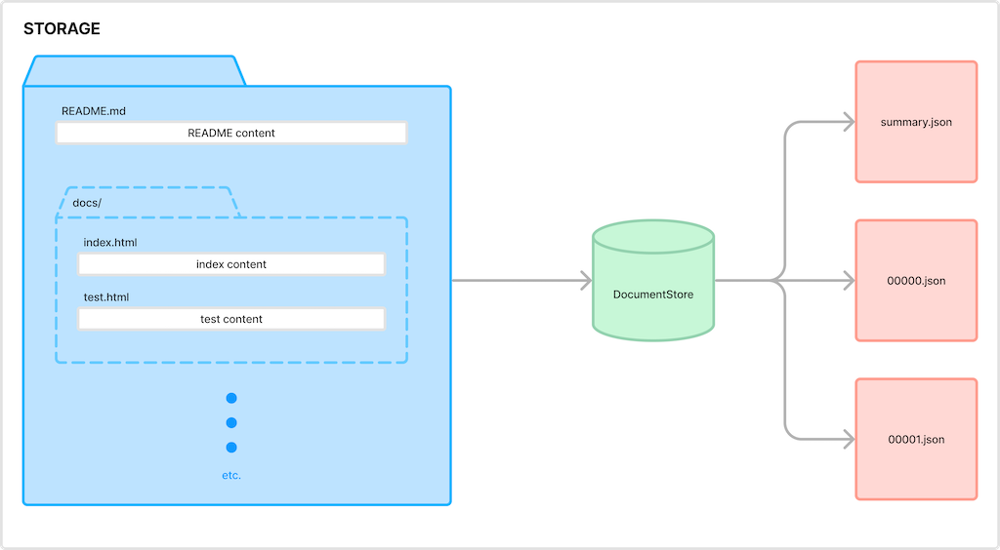
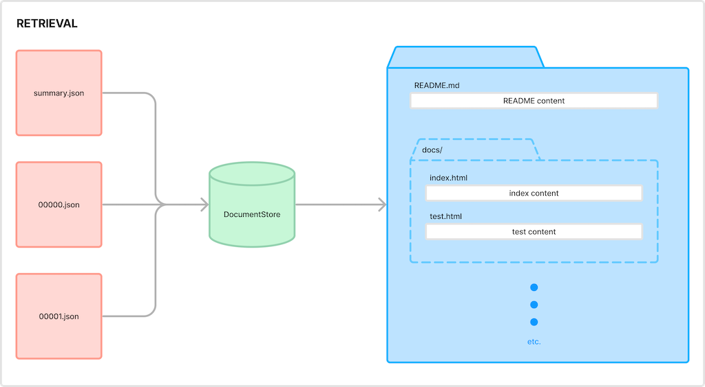

# komment document store

A utility to manage 'chunking' a large array of file data into multiple smaller, indexed array with a quick lookup. Use it on the backend to manage storing and saving against a remote file store (such as a git repo or S3) and use it on the frontend to optimize caching and reduce file retrieval times.





Once initialised, the store can be used to retrieve the contents of a file or queried for the existence of a file within the store without loading the contents. Chunks are lazy loaded and cached so a chunk isn't loaded until the contents of a file inside it are requested but when a chunk is loaded, all files contained within the same chunk are also loaded.

Find out more about komment's open source projects at [komment.ai/open](https://komment.ai/open)

## Prerequisites

This is a Node.js and browser module available through the [npm registry](https://npmjs.com).

To build and develop this library, [download and install Node.js](https://nodejs.org/en/download/).

Installation is done using the [`npm install` command](https://docs.npmjs.com/getting-started/installing-npm-packages-locally).

## Installation

```sh
npm install @komment/document-store
```

## Directory Layout

Here is an overview of the top-level files contained in the repository:

    |
    +- docs
    |
    +- src
    |   |
    |   +- index.ts  # Original TypeScript source for the module
    |
    +- test  # Jest unit tests
    |
    +- types # Type definitions

## Usage

Basic usage simply involves providing a method to handle file retrieval given a file name.

```javascript
import DocumentStore from "@komment/document-store";

const documentStore = new DocumentStore("namespace", (fileName) => {
  // file retrieval code here
});
await documentStore.loadSummary();
```

### File content retrieval

```javascript
const fileContent = await documentStore.getFile(path);
if (!fileContent) return Error("No such file", { cause: 404 });
return fileContent;
```

### Files can be added to the store or updated within the store.

```javascript
documentStore.addFile({
  name: "mock-file",
  path: "path/in/virtual-directory/mock-file.js",
  content: {
    description: "New file content",
  },
});
```

```javascript
documentStore.updateFile({
  name: "mock-file",
  path: "path/in/virtual-directory/mock-file.js",
  content: {
    description: "Updated file content",
  },
});
```

### Updating metadata

```javascript
documentStore.setUpdatedAt(new Date());
```

### Additional metadata

Sometimes it is necessary to add additional metadata to the document store. This can be defined at creation time

```javascript
const documentStore = new DocumentStore(
  "namespace",
  (fileName) => {
    // file retrieval code here
  },
  {
    additional: [],
    data: "",
  },
);
```

This metadata can then be updated as needed

```javascript
documentStore.updateMetadata({ additional: ["some", "data", "here"] });
```

### Saving the updated store

Once the store is in a state to be persisted, there are two methods to provide the output data:

```javascript
const summaryPath = documentStore.getChunkSummaryPath();
const summary = documentStore.outputSummary();
const chunks = documentStore.outputChunks();
```

- `summaryPath` contains the path to the lookup file
- `summary` contains the contents of the lookup file
- `chunks` An object containing chunk paths, each being an array containing the paths and contents of the actual files in the virtual file structure

#### Example output

```javascript
//summaryPath
".namespace/namespace.json"

//summary
{
  "summary": {
    "meta": {
      "version": "1",
      "updated_at": "2024-04-08T13:50:02.790Z",
      "created_at": "2024-04-08T13:50:02.790Z"
    },
    "lookup": [
      [
        "README.md",
        "docs/index.html"
      ],
      [
        "docs/test.html"
      ]
    ]
  }
}


// chunks
{
  ".namespace/00000.json": [
    ["README.md", "README content"],
    ["docs/index.html", "index content"],
  ],
  ".namespace/00001.json": [
    ["docs/test.html", "test content"],
  ]
}
```

## Tests

    npm run test

## How can I contribute?

You want to contribute to this library? Welcome! Please read the [CONTRIBUTING.md](CONTRIBUTING.md).

## License

Copyright (C) 2024 Komment AI, Inc.

MIT license, see the [LICENSE](LICENSE) file in the root of this project for license details.
